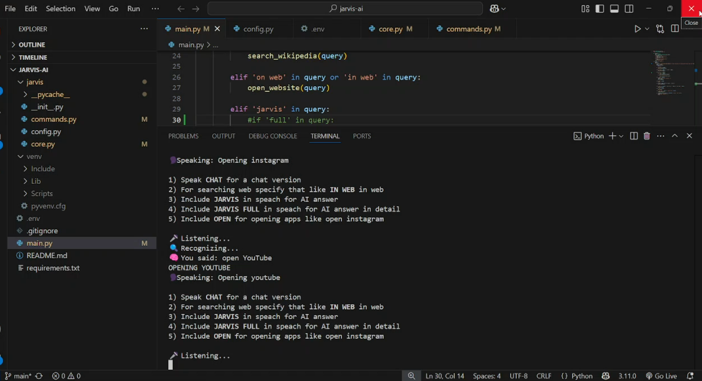
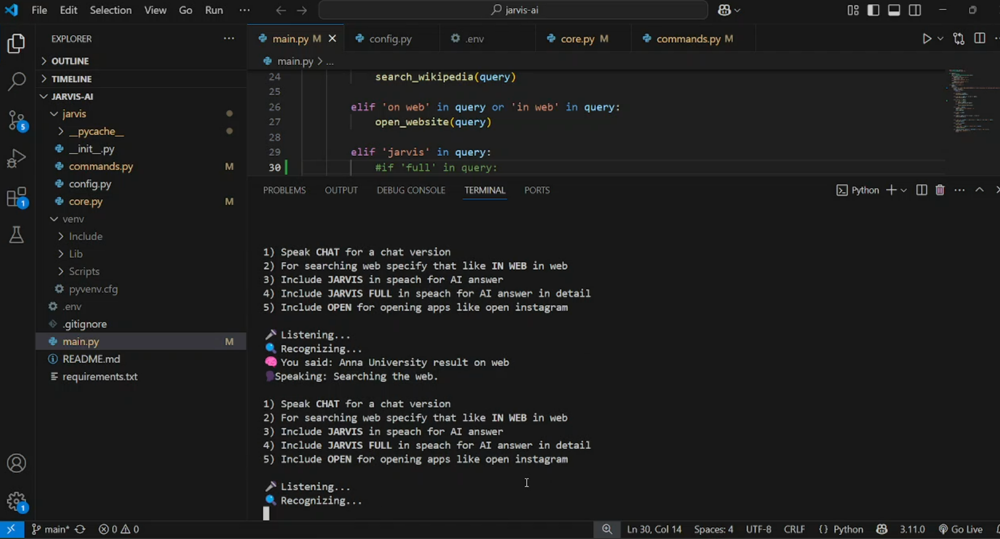

# 🤖 Jarvis AI Assistant

**Jarvis** is a modular **voice-controlled Python AI assistant** powered by **Google Gemma 3n-e4b-it** via NVIDIA’s developer API.  
It supports **speech recognition, app automation, Wikipedia search, web browsing, media playback, and real-time AI conversations.**

---

## 🧠 Features
- 🎙️ **Voice control** using microphone input  
- 🧾 **Wikipedia lookup** for quick summaries  
- 🧠 **Real-time LLM responses** via NVIDIA Gemma API  
- 🗂️ **App automation** (open/close installed apps)  
- 🌐 **Web search** via Bing  
- 🎧 **Media playback & file explorer automation**  
- 🗨️ **Conversational chat mode** with LLM  

---

## ⚙️ Tech Stack
| Component         | Description                                      |
|-------------------|--------------------------------------------------|
| **Python**        | Core logic                                       |
| **SpeechRecognition** | Microphone voice input                        |
| **pyttsx3**       | Offline text-to-speech synthesis                 |
| **AppOpener**     | App automation on Windows                        |
| **wikipedia**     | Wikipedia summary queries                        |
| **requests**      | HTTP client for NVIDIA LLM API calls             |
| **python-dotenv** | Secure environment variable loading              |

---

## 🔐 API Integration
This assistant uses the **Google Gemma 3n-e4b-it** model via **NVIDIA’s Build Platform**.

🔗 [View Model on NVIDIA Build Platform](https://build.nvidia.com/google/gemma-3n-e4b-it)

**Setup your API Key:**
1. Sign up at [https://build.nvidia.com](https://build.nvidia.com)  
2. Get your NVIDIA API key  
3. Create a `.env` file in your root directory:  

```env
NVIDIA_API_KEY=your_nvidia_api_key_here
NVIDIA_API_BASE_URL=https://integrate.api.nvidia.com/v1
📦 Installation
bash
Copy
Edit
git clone https://github.com/Basilbaasi/Jarvis---AI.git
cd Jarvis---AI
pip install -r requirements.txt
🚀 Run the Assistant
bash
Copy
Edit
python main.py
Example commands:

“Jarvis open YouTube”

“Jarvis what is machine learning”

“Jarvis play music”

“Jarvis search pandas in web”

🖼️ Screenshots

### Opening Instagram


### Searching Anna University



🎥 Demo Video

https://www.linkedin.com/posts/basilck_python-ai-voiceassistant-activity-7354211469388849153-FYhw?utm_source=share&utm_medium=member_desktop&rcm=ACoAAELiM9UBv8pB4-nII9XJ7sJU14Ar1BFMw5w

📄 License
This project is licensed under the MIT License.

✨ Credits
Built with 💻 by Basil C K
Powered by Google Gemma LLM via NVIDIA Build Platform